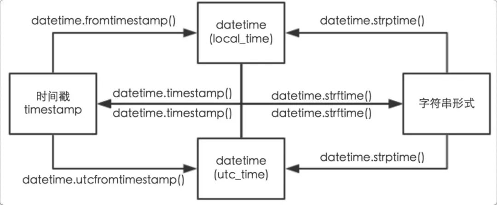

# Python的时间相关用法


### 相关函数功能转换示意图




### 字符串转整数时间戳

```python
import time

int(time.mktime(time.strptime('2013-10-10 23:40:00', "%Y-%m-%d %H:%M:%S")))
# 1381419600
```


### 整数时间戳转字符串

```python
import time

time.strftime("%Y-%m-%d %H:%M:%S",time.localtime(1557673200))
# '2019-05-12 23:00:00'
```


### 某一时间的前后几天

```python
from datetime import datetime, timedelta

datetime.now() + timedelta(days = 1)
```


### 某一时间的前后几月

`timedelta`不支持月的单位，需要用`dateutil`

```python
from datetime import datetime
from dateutil.relativedelta import relativedelta

datetime.now() + relativedelta(months = 1)
```


### 


